# Mermaid手册

Tags : Mermaid

---

## 简介

Mermaid可以用来画流程图、时序图、状态图、饼图、类图、甘特图。广泛用于Markdown。

* 官方网址: <https://mermaidjs.github.io/>
* Mermaid在线编辑器，可生成Markdown图片链接: <https://mermaidjs.github.io/mermaid-live-editor>

## Markdown中使用Mermaid绘图

* (Cmd Markdown语法不一样)

        ```mermaid
        graph LR;
            Portal-->|发布/更新配置|Apollo配置中心;
            Apollo配置中心-->|实时推送|App;
            App-->|实时查询|Apollo配置中心;
        ```

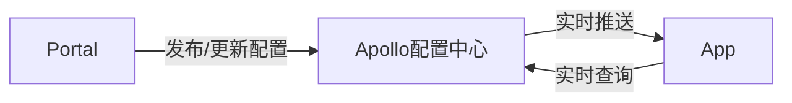

## Flowchart

### Graph 图

```text
graph 方向
    其它语句...
```

其中，方向可用`LR`左->右,`RL`右->左,`TB`或`TD`上->下,`BT`下->上。

### Nodes 节点

每个节点都有3个属性，id、text、shape。text是显示在图像上的内容；shape通过不同的括号来定义。

1. `id0[text0] --> id1(text1)`

    ```mermaid
    graph LR
        id0[text0] --> id1(text1)
    ```

2. `id0[(text0)] --> id1([text1])` [Typora不支持]

    ```mermaid
    graph LR
        id0[(text0)] --> id1([text1])
    ```

3. `id0((text0)) --> id1>text1] --> id2{text2} --> id3{{text3}}`

    ```mermaid
    graph LR
        id0((text0)) --> id1>text1] --> id2{text2} --> id3{{text3}}
    ```

4. `id0[/text0/] --> id1[\text1\] --> id2[/text2\] --> id3[\text3/]`

    ```mermaid
    graph LR
        id0[/text0/] --> id1[\text1\] --> id2[/text2\] --> id3[\text3/]
    ```

### Lines 连线

* `-->`实线前箭头，`---`实线无箭头，`-.->`虚线带箭头，`-.-`虚线无箭头，`=`替换`-`表示粗线(Typora上看不出来)。

    ```mermaid
    graph LR
        A --> B --- C -.-> D -.- E ==> F
    ```

* `A--方式1-->B-->|方式2|C--方式1---D---|方式2|E-.方式1.-F-.-|方式2|G`线上带文字

    ```mermaid
    graph LR
        A--方式1-->B-->|方式2|C--方式1---D---|方式2|E-.方式1.-F-.-|方式2|G
    ```

* `&`多重连接(Typora不支持)

    ```mermaid
    graph LR
        A-->B & C-->D
    ```

### 特殊字符处理

* 将字符串用双引号括起来

    ```text
    graph LR
        id1["This is the (text) in the box"]
    ```

    ```mermaid
    graph LR
        id1["This is the (text) in the box"]
    ```

* 双引号及其它特殊字符示例

    ```text
    graph LR
        A["A double quote:#quot;"] -->B["A dec char:#9829;"]
    ```

    ```mermaid
    graph LR
        A["A double quote:#quot;"] -->B["A dec char:#9829;"]
    ```

### Subgraph 子图

```text
subgraph 子图名称
    绘图语句
end
```

示例：

```text
graph TB
    c1-->a2
    subgraph one
        a1-->a2
    end
    subgraph two
        b1-->b2
    end
    subgraph three
        c1-->c2
    end
```

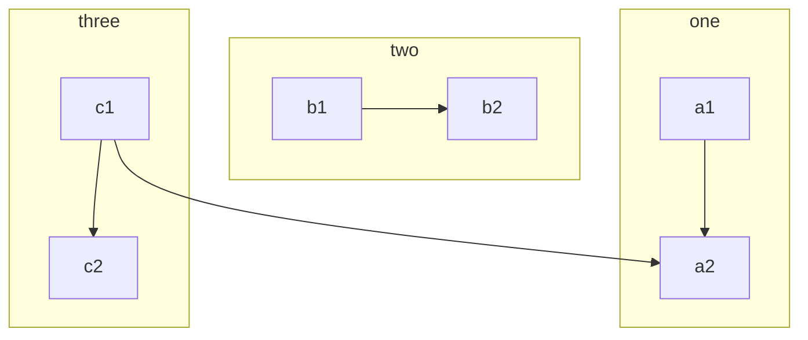

### 其它Flowchart复杂功能参见官方文档

## Sequence diagram

### Participants 参与者

* 可以**隐式定义**或**显式定义**。显式定义用语句`participant XXX`，可以确保Participants的显示顺序。
* 可以使用别名(alias)来方便书写

隐式定义示例：

```text
sequenceDiagram
    Alice->>John: Hello John, how are you?
    John-->>Alice: Great!
```

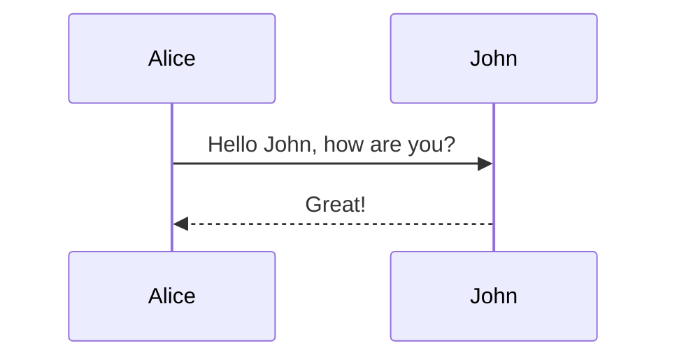

显式定义及别名示例：

```text
sequenceDiagram
    participant J as John
    participant A as Alice
    A->>J: Hello John, how are you?
    J-->>A: Great!
```

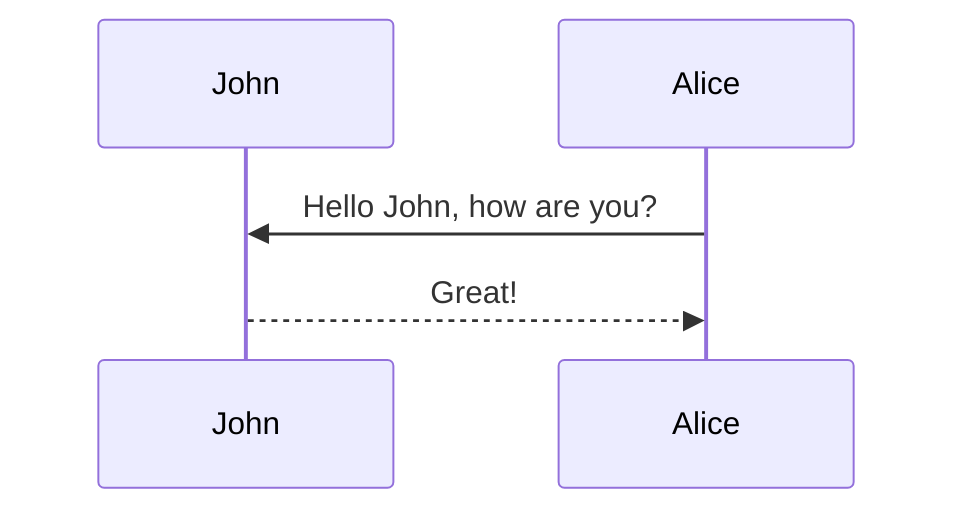

### Message 消息

格式:

```text
[Participant][Arrow][Participant]:Message text
```

箭头Arrow类型:
| Type | Description |
| :---: | :--- |
| -> | Solid line without arrow |
| --> | Dotted line without arrow |
| ->> | Solid line with arrowhead |
| -->> | Dotted line with arrowhead |
| -x | Solid line with a cross at the end (async) |
| --x | Dotted line with a cross at the end (async) |

### Activations 激活

* 使用`activate XXX`激活, `deactivate XXX`反激活。
* 可以用后缀`+`和`-`来表示`activate`和`deactivate`。
* 可以堆叠

示例:

```text
sequenceDiagram
    A->>B: Req
    activate B
    B-->>A: Ack
    deactivate B

    A->>+B: Req1
    A->>+B: Req2
    B-->>-A: Ack2
    B-->>-A: Ack1
```

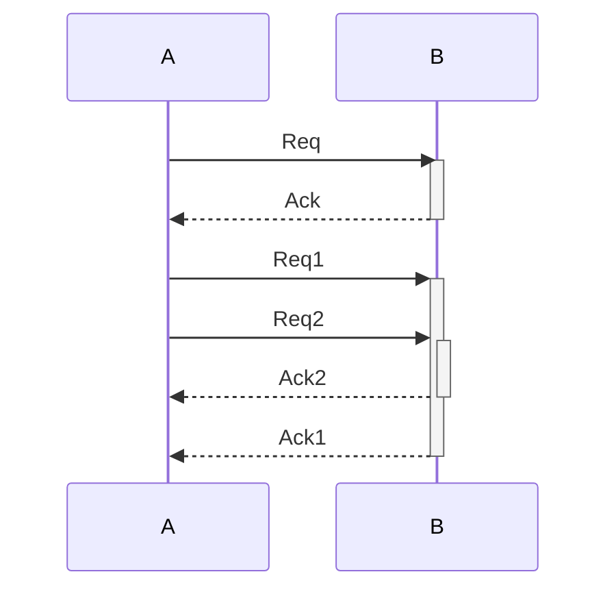

### Notes

格式:

```text
Note [ right of | left of | over ] [Actors]: [Text]
```

示例:

```text
sequenceDiagram
    Alice->John: Hello John, how are you?
    Note over Alice,John: A typical interaction
```

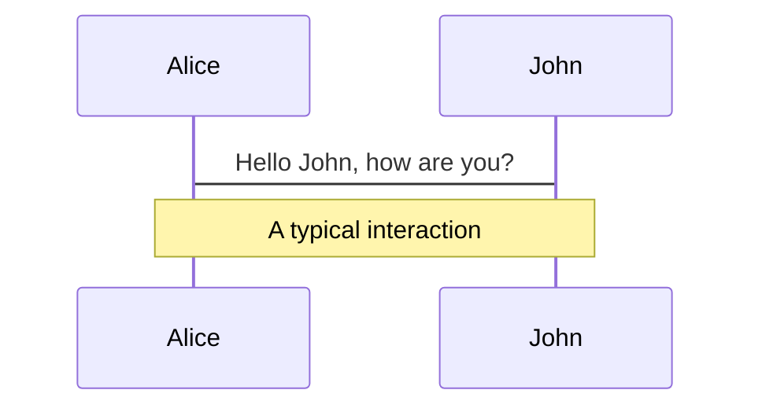

### 循环 Loops

格式:

```text
loop text
... statements ...
end
```

示例:

```text
sequenceDiagram
    Alice->John: Hello John, how are you?
    loop Every minute
        John-->Alice: Great!
    end
```

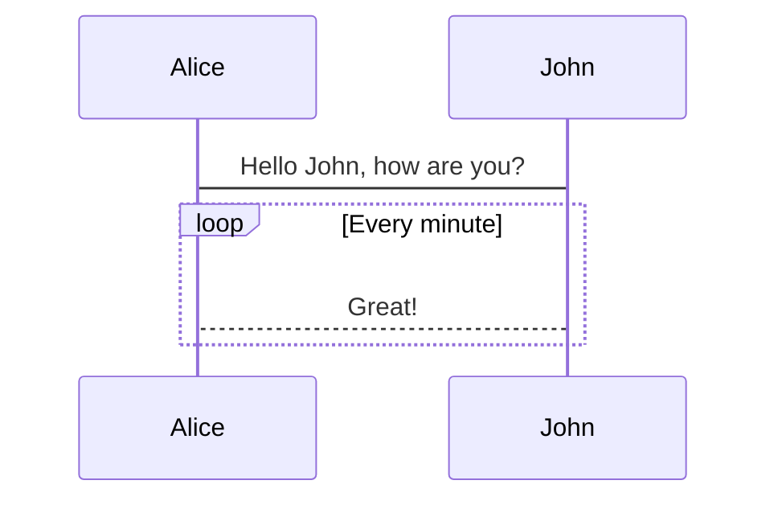

### 条件 Alt

格式:

```text
alt Text1
... statements ...
else Text2
... statements ...
end
```

或者

```text
opt Text
... statements ...
end
```

示例：

```text
sequenceDiagram
    Alice->>Bob: Hello Bob, how are you?
    alt is sick
        Bob->>Alice: Not so good :(
    else is well
        Bob->>Alice: Feeling fresh like a daisy
    end
    opt Extra response
        Bob->>Alice: Thanks for asking
    end
```

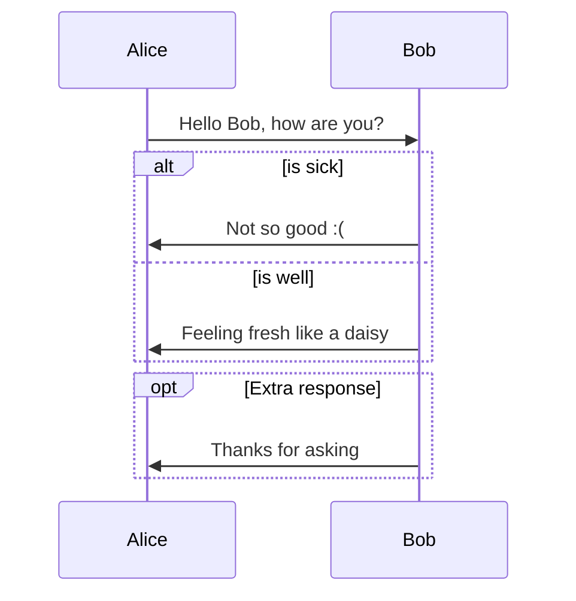

### 背景框 Backgroud

用`rect`定义矩形背景框。
格式:

```text
rect rgb(0, 255, 0)
... statements ...
end
```

或

```text
rect rgba(0, 0, 255, 0.1)
... statements ...
end
```

示例:

```text
sequenceDiagram
    rect rgb(255,255,0)
        rect rgba(0,255,0,0.5)
            Alice->>Bob: Hello Bob, how are you?
            alt is sick
                Bob->>Alice: Not so good :(
            else is well
                Bob->>Alice: Feeling fresh like a daisy
            end
        end
        opt Extra response
            Bob->>Alice: Thanks for asking
        end
    end
```

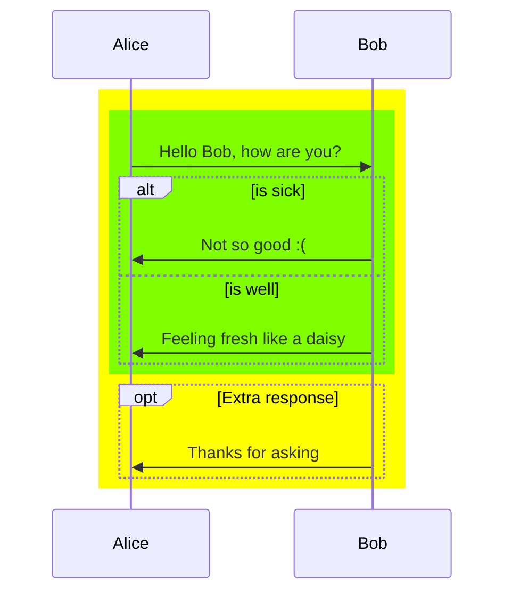

### 注释 Comments

* 独立一行，以`%%`开头
示例：

```text
sequenceDiagram
    %% haha
    A ->> B: go
    B -->> A: OK
```

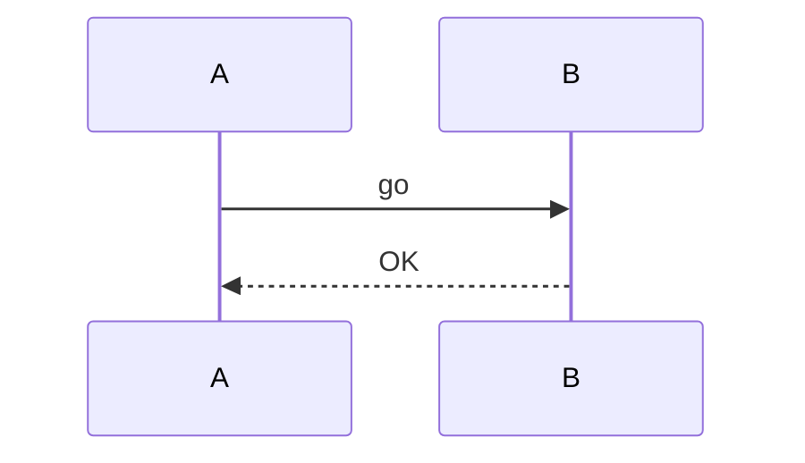

### 其它Sequence diagram复杂功能参见官方文档

## Pie Chart

示例:

```text
pie
    title Key elements in Product X
    "Calcium" : 42.96
    "Potassium" : 50.05
    "Magnesium" : 10.01
    "Iron" :  5
```

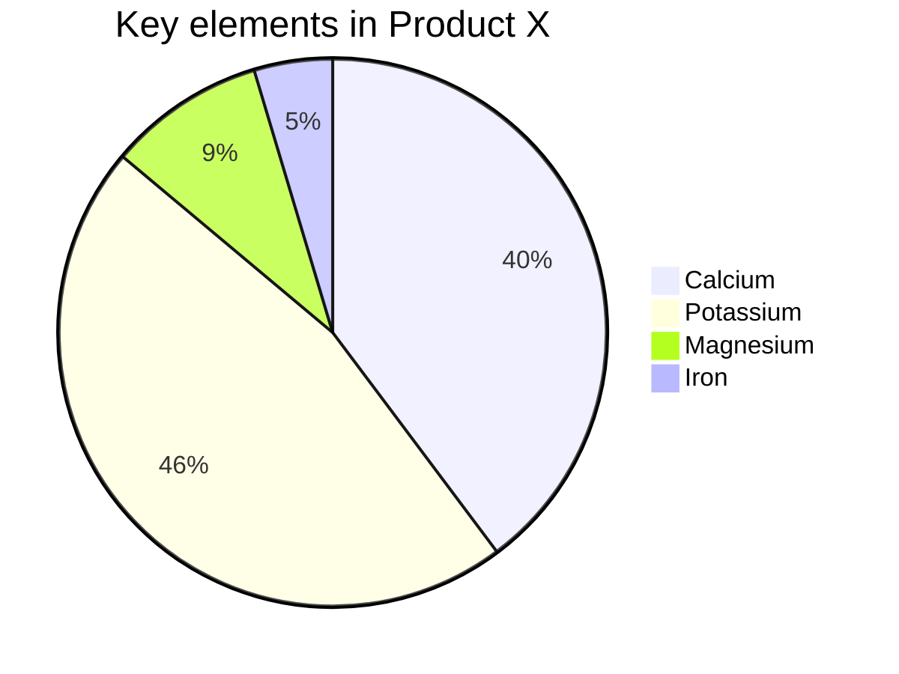

## State Diagram

* 语法兼容plantUml

### States 状态

定义状态的三种方式:

1. 直接用名字`xxx`
2. `state "Text" as xxx`
3. `xxx : "Text"`

### Transitions 转移

两种方式:

1. `s1 --> s2`
2. `s1 --> s2 : Text`

### Start and End

* 都是`[*]`，根据位置自动确定是Start还是End。`[*]-->s`是Start，`s-->[*]`是End。

### Composite states 组合状态

```text
stateDiagram
    [*] --> First
    First --> Second : text
    First --> Third
    Third --> [*]

    state First {
        state "long text" as l
        [*] --> l
        l --> [*]
    }
    state Second {
        l : "long text 2"
        [*] --> l
        l --> [*]
    }
    state Third {
        [*] --> thi
        thi --> [*]
    }
```

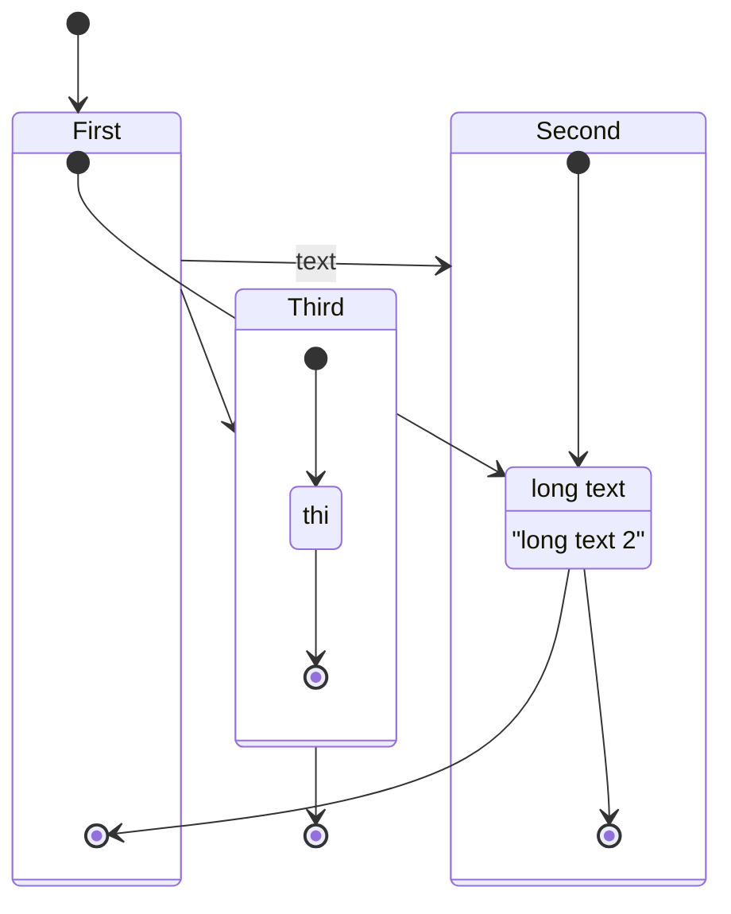

### Forks

示例:

```text
stateDiagram
    state fork_state <<fork>>
    [*] --> fork_state
    fork_state --> State2
    fork_state --> State3

    state join_state <<join>>
    State2 --> join_state
    State3 --> join_state
    join_state --> State4
    State4 --> [*]
```

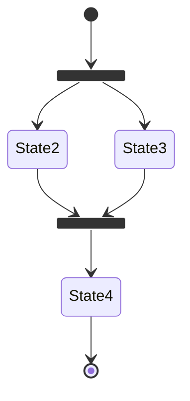

### Pie Chart Notes

格式:

```text
note [left of | right of] [State] : [Text]
```

或

```text
note [left of | right of] [State]
    [Long Text]
end note
```

示例:

```text
stateDiagram
    State1: The state with a note
    note right of State1
        Important information! You can write
        notes.
    end note
    State1 --> State2
    note left of State2 : This is the note to the left.
```

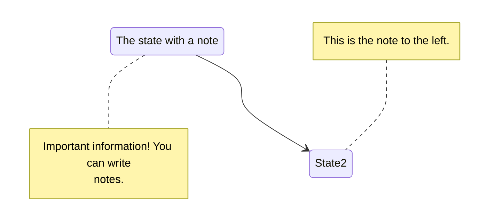

### Concurrency

使用`--`分隔。

示例：

```text
stateDiagram
    [*] --> Active

    state Active {
        [*] --> NumLockOff
        NumLockOff --> NumLockOn : EvNumLockPressed
        NumLockOn --> NumLockOff : EvNumLockPressed
        --
        [*] --> CapsLockOff
        CapsLockOff --> CapsLockOn : EvCapsLockPressed
        CapsLockOn --> CapsLockOff : EvCapsLockPressed
        --
        [*] --> ScrollLockOff
        ScrollLockOff --> ScrollLockOn : EvCapsLockPressed
        ScrollLockOn --> ScrollLockOff : EvCapsLockPressed
    }
```

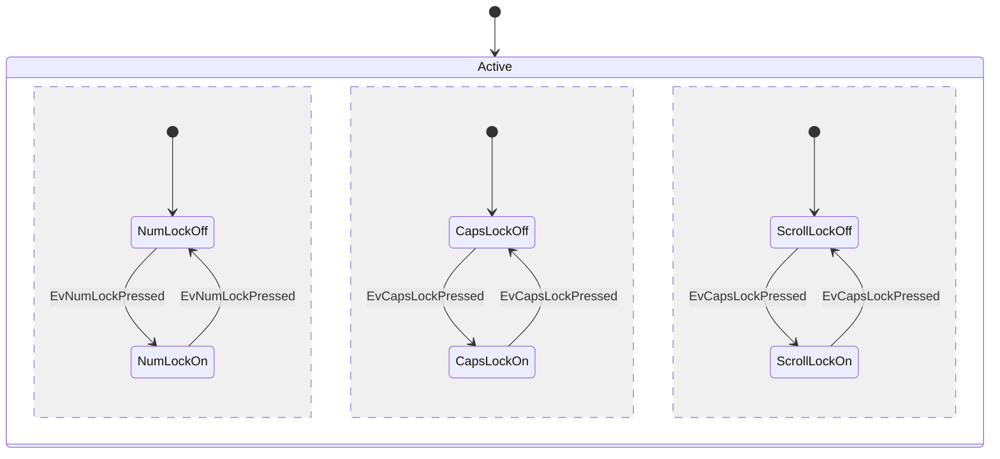

### Comments 注释

* `%%`，同一行后面的都是注释

## Class Diagram

不好用。

## Gantt

不好用。
